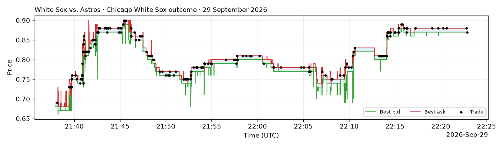

# polycollect — Polymarket market data collection and replay

[](https://github.com/eharaldson/polymarket-data-collection/actions/workflows/ci.yml)

Record live Polymarket order book snapshots, price-level updates, trades and
tick-size changes to daily Parquet files. Supply a market or event URL to
start collecting, then use the replay helpers to reconstruct recorded order
books for analysis.

- **Research-ready records.** Selected event fields are normalized into rows,
  with exchange timestamps and local receipt times. Price and size strings
  are preserved.
- **Automatic subscriptions.** Resolve event URLs into their open markets and
  refresh subscriptions as markets are added or close.
- **Order book replay.** Reconstruct full-depth books from snapshots and
  updates, resetting state after reconnects. Book and price-change rows also
  include best-bid and best-ask fields for quote analysis.

Built by [Erik Haraldson](https://github.com/eharaldson) and
[Prashast Vir](https://github.com/prash-vir), co-founders of
[EvenFold](https://www.evenfold.ai/), from our work on prediction-market
trading infrastructure.

## Example

45 minutes of the White Sox vs. Astros game on 29 September 2026, recorded with
`polycollect market:mlb-cws-hou-2026-09-29`. One market with two books produced
93,829 rows: 92,656 level changes, 784 book snapshots, 388 trades and one
connection marker. The recording runs from 21:37:55 to 22:22:54 UTC.



To reproduce the chart and quote check, follow the installation steps below,
[download the recording](https://github.com/eharaldson/polymarket-data-collection/releases/download/v0.1.0/mlb-cws-hou-2026-09-29.zip)
(2.9 MB), and unzip it into the repository directory to create `data/`.
Use an empty `data/` directory so the example does not mix with other recordings.
Then run:

```bash
pip install pandas matplotlib
python examples/plot_quotes.py data docs/example.png --title "White Sox vs. Astros"
python examples/verify_replay.py data
```

The replay check produces **79,706 matching quote pairs and zero mismatches**
for this recording. It compares the last replayed state for each connection
session, token and exchange timestamp when that state's row is a price change
with both reported quotes. It treats 0 and 1 as empty bid and ask sentinels.
This checks top-of-book consistency at those sampled states; it does not
establish complete capture or validate every depth level. Timestamps are not
unique exchange update identifiers. See
[`examples/verify_replay.py`](examples/verify_replay.py) for the exact check.

---

## Quickstart

Requires **Python 3.10+**. No wallet or API key is required. The commands below
use a macOS/Linux shell; replace the quoted placeholder with an open event URL.

```bash
git clone https://github.com/eharaldson/polymarket-data-collection.git
cd polymarket-data-collection
python -m venv .venv && source .venv/bin/activate
pip install -e .

polycollect "https://polymarket.com/event/<event-slug>"
```

Stop it with Ctrl-C to flush buffered rows and seal the current file. To check what a
slug resolves to before recording:

```bash
polycollect "<slug-or-url>" --list
```

### What to pass

| Input | Records |
|---|---|
| `https://polymarket.com/event/<event>` | Every open market in the event, re-checked every `--refresh` seconds |
| `https://polymarket.com/event/<event>/<market>` | Just that market |
| `<slug>` | The event with that slug, or else the market with that slug |
| `event:<slug>` / `market:<slug>` | Only that kind (an event's main market can share the event's slug) |

Pass several to record them all into one dataset: `polycollect slug-a slug-b`.

### Options

```
polycollect SLUG_OR_URL [SLUG_OR_URL ...]
            [--data-dir DIR]      # default: $DATA_DIR or ./data
            [--refresh SECONDS]   # re-resolve slugs; 0 = never (default 300)
            [--list]              # print resolved markets and token IDs, then exit
```

---

## Output

```
{data-dir}/{YYYY-MM-DD}/events.parquet
                        events.part1.parquet
                        events.part2.parquet ...
```

Days are UTC. The collector seals the current file every five minutes; the
next row starts a new part. A file still being written ends in `.tmp`. A crash
can lose data since the last successful seal. Ctrl-C or SIGTERM flushes
buffered rows and seals the current file, and a restart continues the day's
part sequence. Give each running process its own `--data-dir`.

Rows retain arrival order. A price-change message becomes one row per changed
level. Fields may be null when absent from the feed:

| `event_type` | What it is | Filled columns |
|---|---|---|
| `book` | Full snapshot of one token's book, sent on subscribe and after trades | `bids_json`, `asks_json`, `best_bid`, `best_ask`, `tick_size`, `hash` |
| `price_change` | One price level changed. `size` is the new total at that price; `0` means the level is gone | `side` (`BUY` = bid), `price`, `size`, `best_bid`, `best_ask`, `hash` |
| `last_trade_price` | A trade | `side`, `price`, `size` |
| `tick_size_change` | The minimum price increment changed | `tick_size` |
| `connected` | The collector (re)connected. Books are unknown until their next snapshot | only `recv_time` |

Every market-event row also has `recv_time` (local receipt time, ms), `timestamp`
(Polymarket's time, ms), `slug`, `outcome` (e.g. `Yes`), `asset_id` (the token
ID) and `market` (the condition ID). Prices and sizes are strings exactly as
sent. The schema is in [`polycollect/collector.py`](polycollect/collector.py).

---

## Reading the data

The examples below use the downloaded White Sox–Astros recording in `data/`.
For your own recordings, substitute the market slug and outcome.
Install pandas for the quote example:

```bash
pip install pandas
```

Top of book over time:

```python
from polycollect.replay import read_events

df = read_events("data").to_pandas()            # or one day: "data/2026-09-29"
rows = df[(df.slug == "mlb-cws-hou-2026-09-29") & (df.outcome == "Chicago White Sox")]
quotes = rows[rows.event_type.isin(["book", "price_change"])]
mid = (quotes.best_bid.astype(float) + quotes.best_ask.astype(float)) / 2

trades = rows[rows.event_type == "last_trade_price"]
```

Full depth, rebuilt event by event. This prints the latest reconstructed book
for the White Sox token in the example recording:

```python
from polycollect.replay import read_events, replay

events = read_events("data")
token_id = next(
    row["asset_id"]
    for row in events.select(["slug", "outcome", "asset_id"]).to_pylist()
    if row["slug"] == "mlb-cws-hou-2026-09-29" and row["outcome"] == "Chicago White Sox"
)
latest = None
for event, book in replay(events, asset_ids=[token_id]):
    latest = book

if latest is None:
    raise ValueError("No snapshot was recorded for this token")
bids, asks = latest.levels(depth=5)             # [(price, size), ...] best first
print(" bid size    bid |   ask  ask size")
for (bid, bid_size), (ask, ask_size) in zip(bids, asks):
    print(f"{bid_size:9,.0f}  {bid:.3f} | {ask:.3f}  {ask_size:,.0f}")
```

```
 bid size    bid |   ask  ask size
       44  0.870 | 0.880  56,961
   74,569  0.860 | 0.890  10,784
   30,645  0.850 | 0.900  2,549
      617  0.840 | 0.910  2,297
      598  0.830 | 0.920  4,128
```

`replay()` applies snapshots and deltas per token, skips deltas it can't place
(before the first snapshot, or after a reconnect until the next one), and takes
`asset_ids=[...]` to rebuild only some tokens.
The `latest` reference is the last state yielded, not a guarantee of a valid
book at the recording's end: a later reconnect invalidates it until another
snapshot arrives.

## Things to know

1. **Two clocks.** `recv_time` is the local time when the collector reads a
   message; `timestamp` comes from Polymarket. Both are milliseconds since
   the Unix epoch, but the clocks can differ. Preserve stored row order for
   replay, use receipt times for local timing analysis, and keep the host
   clock synchronized with NTP.
2. **One message can span several rows.** Price-change messages can contain
   several level changes. Matching token IDs and timestamps do not prove
   that rows belong to a single exchange update. Preserve all rows for
   replay; do not deduplicate deltas by timestamp. A reported quote can
   reflect changes that have not all been applied at an intermediate row.
3. **Reconnects identify potential gaps.** A `connected` row marks each
   connection or reconnection. Replay discards old books and waits for each
   token's next snapshot. These markers do not detect every possible missing
   event, and the collector does not backfill missed data.
4. **Each outcome is its own book.** Complementary outcomes such as `Yes` and
   `No` have separate tokens and bid/ask quotes. Executable prices need not
   sum to one; inspect the outcome and side you intend to trade.
5. **Prices are strings on purpose.** Recorded price and size strings preserve
   the feed's decimal representation. Convert them as needed for analysis;
   the replay helper uses floating-point numbers internally.

## Running it 24/7

```bash
docker build -t polycollect .
docker run -d --restart unless-stopped -v "$PWD/data:/data" polycollect "<slug-or-url>"
```

Or run `polycollect` under any process manager that restarts it if it exits.

## Development

```bash
pip install -e ".[dev]"
pytest
ruff check .
```

## License

Distributed under the [MIT License](LICENSE).

Nothing here is investment advice. Check Polymarket's terms of service for your
jurisdiction before you run it.
